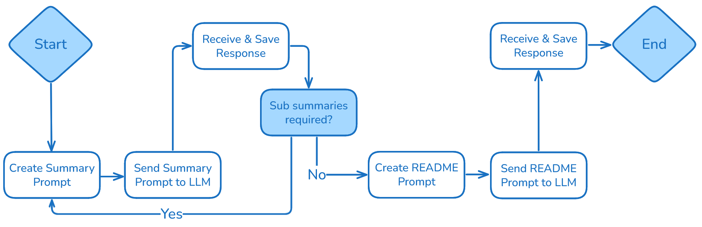

# ma_automated_documentation  

## Description  
This repository contains the source code for the thesis *Intelligent Documentation: Automated Generation of GitHub README Files with Large Language Models and Dynamic Prompts*.  

This thesis explores an approach to generate README files for 199 GitHub public repositories using large language models and dynamic prompts. While GitHub offers voluntarily guidelines for the README creation, some software developers omit or insufficiently follow them due to time constraints or failure, resulting in poor documentation.  

A simple proof of concept tested the feasibility of generating READMEs using large language models. Data was collected via the GitHub application programming interface, and source code, written in Python, was extracted and prepared for processing. Two types of large language models were used to generate READMEs for the selected repositories.  

Quality was assessed by comparing original and generated READMEs using three evaluation large language models and comparison-based questions. The questions adhere to the GitHub guidelines. The results show that the original READMEs generally achieved higher scores than the generated ones. Nevertheless, the generated READMEs still provided valuable information, particularly about the repository's content and the implementation details. Prompt design and large language model choice have impact on the generated README and offer further adjustments to increase the README quality.  

All written and used Python scripts and Juypter Notebooks are available in this repository. The provided source code does not create an application or program to generate a README for a specified repository.  
It shows the applied approach to answer the corresponding research question:    
+ How does the quality of README files generated with an large language model and custom prompts compare to the original README for a GitHub repository?
+ Does the quality of the original README vary when GitHub repositories are chosen based on specific criteria?  

Detailed explanation for the implementation can be found in the thesis. The flow chart shows a simplified overview of creation process for a README.  




## Usage
This repository has five main directories:  
+ github_api/  
+ pre_processing/  
+ model/  
+ evaluate_results/  

The structure of this repository is visualized in paragraph **Structure**.  
The external dependencies required for this project are listed in the *requirements.txt* file. To execute the provided source code in conjunction with external services, such as the GitHub, Snowflake, and Hugging Face APIs, valid credentials are necessary. It is recommended to store these credentials securely in a local *.env* file. For this project, Python in the version 3.12.3 was used.  

There are two categories of Python source files used in this project:    
+ Primary implementation files: These contain the core logic required to perform the main task (e.g., XX_xxxx.py/-.ipynb).  
+ Helper files: These support the overall workflow by handling supplementary tasks, such as compressing directories, but are not essential to the core implementation.  

### github_api/  
This directory contains the source code for the collection of the metadata and data of the used GitHub repositories.  

### preprocessing/  
This directory includes the required preprocessing steps for the metadata and data of the chosen GitHub repositories.  

In the files *01_repos_metadata.ipynb, 02_analyse_repos_metadata.ipynb, 03_get_split_of_repos.ipynb* the metadata were analyzed and prepared for collection of the entire GitHub repositories.

The files *04_data_cleaning.py, 05_counts.ipynb* are used to clean and prepare the GitHub repository data for the creation of the READMEs.

### model/    
All required scripts for Snowflake integration are stored in this folder. This refer to the creation of summary, sub-summaries, READMES and evaluation of the original and generated READMEs.  

### evaluate_results/    
This folder contains the analysis of evaluation results, organized across multiple Jupyter notebooks, each corresponding to a specific README creation process and its respective modifications.

The used data are not provided in this project as they are very extensive.  

## Structure
```bash
automated_documentation/
├── LICENSE.md
├── README.md
├── evaluate_results
│   ├── 01_evaluate_df_llama.ipynb
│   ├── 02_evaluate_df_jamba.ipynb
│   ├── 03_1_evaluate_df_llama_mod.ipynb
│   ├── 03_2_evaluate_df_jamba_mod.ipynb
│   ├── 03_3_evalution_question_score_first_and_modified_prompt.ipynb
│   ├── 03_4_evalution_total_score_first_and_modified_prompt.ipynb
│   ├── helper_clean_score_m1.ipynb
│   ├── helper_clean_score_m2.ipynb
│   ├── helper_clean_score_m3.ipynb
│   └── ignore_repo.txt
├── github_api
│   ├── 00_get_repo_metadata.py
│   ├── 01_get_repo_metadata.py
│   ├── 02_get_repo_data.py
│   ├── helper_get_poc_repos.ipynb
│   ├── helper_rezip_files.py
│   └── helper_zip_files.py
├── model
│   ├── 01_summary_readme.py
│   ├── 01_summary_readme_mod.py
│   ├── 02_readme_evaluation.py
│   ├── helper_count_files.py
│   ├── helper_count_tokens.ipynb
│   ├── helper_read_readme.ipynb
│   ├── helper_readme_length.ipynb
│   ├── readmes_manual_checked
│   │   ├── JakeWharton_pidcat.ipynb
│   │   ├── andkret_cookbook.ipynb
│   │   ├── awslabs_aws-config-to-elasticserach.ipynb
│   │   ├── lennylxx_ipv6-hosts.ipynb
│   │   ├── majumderb_rezero.ipynb
│   │   ├── realpython_cookiecutter-flask-skeleton.ipynb
│   │   └── sebastianruder_NLP-progress.ipynb
│   └── test_readme
│       ├── openstack_generated.md
│       └── openstack_original.md
├── preprocessing
│   ├── 01_repos_metadata.ipynb
│   ├── 02_analyse_repos_metadata.ipynb
│   ├── 03_get_split_of_repos.ipynb
│   ├── 04_data_cleaning.py
│   ├── 05_counts.ipynb
│   ├── helper_clean_filenames.ipynb
│   ├── helper_plot_first_request_metadata.ipynb
│   └── test
│       └── test_read_readme.ipynb
├── img
│   └── flow_readme_creation.png
└── requirements.txt
```

## License  

[MIT](https://choosealicense.com/licenses/mit/)